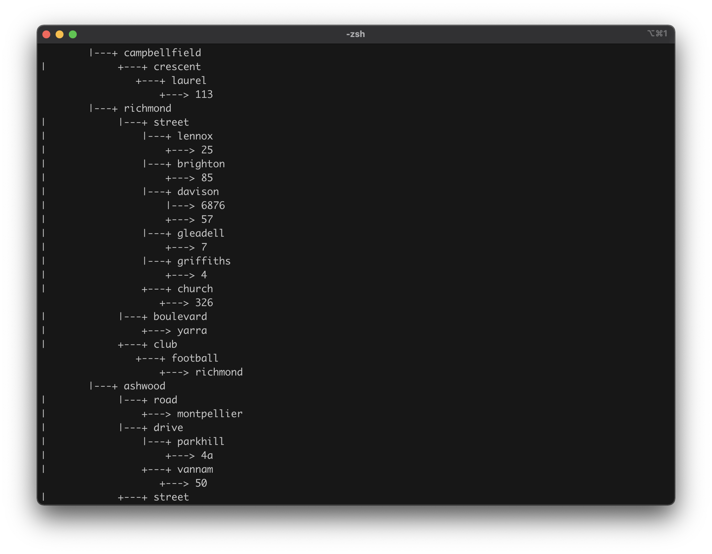

# FunnelCat

## Setup

In terminal run:
```
bundle install
```

## Usage

In terminal run:
```
ruby funnelcat.rb
```

## Structure

Internally FunnelCat is implemented as a search tree.

<p align="center">
  
</p>
